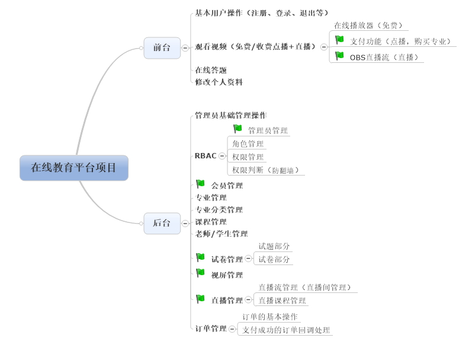
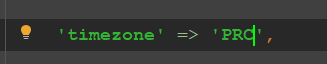
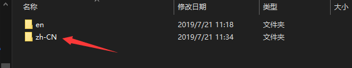
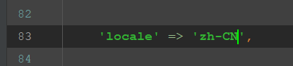
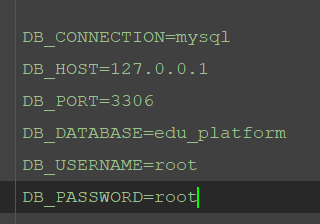
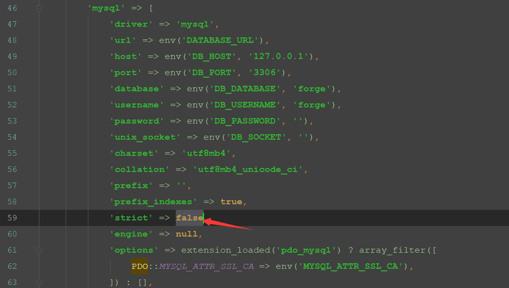
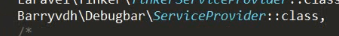
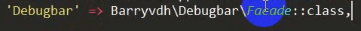
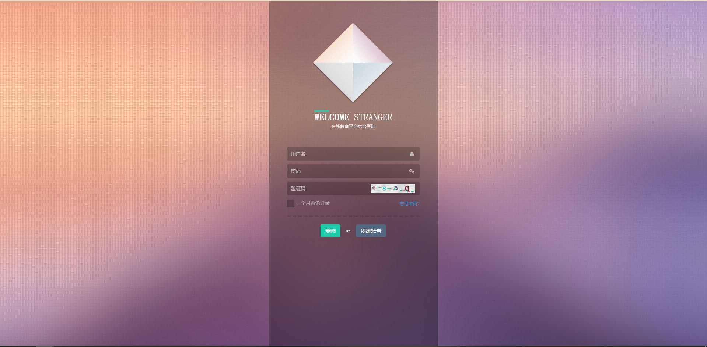

# 1、开发背景
赵某某在一家上市公司担任部门主管，攒下一点积蓄，前段时间他看到在线教育市场很有发展前景，因此从现职公司离职并创办了一家公司打算踏入在线教育行业，随后开始计划招聘数位php工程师来开发一个在线教育系统，初步看看业务效果。招聘需求如下：
* 具有2年以上php开发岗位工作经验；
* 对面向对象思想、MVC思想有深刻的理解；
* 具备Html、JavaScript、Css编写调试能力；
* 熟练使用Laravel框架，具备其他框架使用经验者优先；
* 熟练使用MySQL数据库，并能够为优化数据库提出方案；
* 具备良好的表达能力和团队协作精神；
# 2、功能介绍

## 2.1、技术点说明
将涉及的技术点按类型进行归类，大致如下：
* 前端技术点：为了提高前端的用户体验使用了如**datatables**（数据表格插件）、**layer**（弹窗插件）、**webuploader**（上传插件）、**zyupload**（多文件上传插件）、**ckplayer**（在线播放器）等稳定成型的插件；
* 后端技术点：为了满足项目需求并且提高开发效率以及后期操作的便捷程度，后端使用了如**LaravelExcel**（excel文件操作类）、**七牛SDK**（操作七牛云存储以及直播流管理）、**支付接口**（用于支付，支付宝、微信均可）等技术；
* 安全技术点：在项目中，对应的敏感字段，包括但不限于用户密码，都使用了不可逆加密方法对数据进行了严格的加密；其次，为了防止数据在传输过程中数据被第三方窃取篡改，项目在最终上线部署的时候使用了安全的https协议进行全程加密处理；
## 2.2、开发说明
* 开发环境：windows + apache + mysql + php
* 版本要求：
    * windows：≥ win xp
    * apache：≥ 2.2
    * mysql：≥ 5.5
    * php：≥ 7.0
* 开发框架：laravel（使用composer默认创建的版本）
* 开发周期：6天（后台4天+前台2天）
* 开发工具：sublime text 3（其他替代产品亦可）、cmder（其他替代产品亦可）
* 人员分工：
    * 产品经理（1人）：确定需求以及给出产品原型图
    * 项目经理（1人）：总管项目开发，负责项目开发文档的编写，开发进度的跟踪，为团队人员提供必要的技术支持
    * 设计人员（1人）：根据产品经理给定的产品原型图设计出项目的效果图
    * 前端人员（1人）：根据设计人员设计好的项目效果图，切图并制作项目所需的静态页（模版文件）
    * 后端人员（3人）：根据需求（项目经理提供的项目开发文档或者后期测试人员提供的改进建议），实现对应的模块功能
    * 测试人员（2人）：测试项目各个模块是否存在问题（包括但不限于逻辑问题、安全问题），记录并提交给后端人员处理
# 3、项目初始化
时区、本地化、数据库配置、禁用严格模式、删除自带的用户基础文件、安装debugbar
**①创建laravel项目**
```php
composer create-project laravel/laravel --prefer-dist ./
```
**②设置时区**
修改config/app.php



**③项目本地化操作**

* 下载语言包：Laravel-lang
* 下载地址：https://packagist.org/?query=laravel-lang
* 命令：composer require caouecs/laravel-lang:~4.0
* 将语言包从vendor/caouecs/laravel-lang/src复制到resources/lang目录下


* 修改config/app.php中的关于本地化的配置项



**④配置数据库**
* 创建数据库：edu_platform
* 配置数据库连接，需要修改.env文件


* 推荐禁用mysql的严格模式，需要修改config/database.php：

**⑤删除系统自带的非必要性文件**
```txt
app/User.php
app/Http/Controllers/Auth
database/migrations/*.php
database/seeds/*.php
public/css
public/js
resources/views/welcome.blade.php
```
**⑥（可选）安装debugbar，要求php大于7.0**
* 下载地址：https://packagist.org/packages/barryvdh/laravel-debugbar
* 命令：composer require barryvdh/laravel-debugbar
* 安装好后在config/app.php中添加providers和aliases数组的配置：




# 4、后台基础功能
后台登陆、退出、后台首页页面展示

**后台登陆页面**



